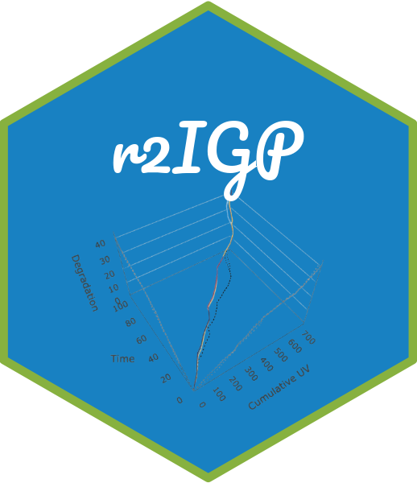

# r2IGP 

<!-- badges: start -->

<!-- [](https://github.com/liangliangzhuang/r2IGP/actions/workflows/R-CMD-check.yaml) -->

<!-- [](https://app.codecov.io/gh/liangliangzhuang/r2IGP) -->

<!-- badges: end -->

## Overview

The **r2IGP** package is designed to provide engineers and researchers
with a powerful tool for **reliability analysis** and **degradation
modeling**, particularly using **Two-Scale Reparameterized Inverse
Gaussian Processes**. This package offers a variety of features,
including:

- **Data Simulation**: Generate simulated data that follows the
  Two-Scale Reparameterized Inverse Gaussian Process, ideal for
  reliability analysis and degradation modeling.

- **Degradation Path Visualization**: Allows users to visually display
  degradation paths, aiding in the analysis and understanding of the
  process.

- **Statistical Inference**: Provides methods for statistical inference
  across different models to estimate reliability and degradation
  characteristics from data.

- **Reliability Analysis**: Conduct in-depth reliability analysis of
  engineering systems or components, supporting a wide range of
  engineering applications.

## Installation

You can install the development version of r2IGP from
[GitHub](https://github.com/) with:

``` r
# install.packages("devtools")
devtools::install_github("liangliangzhuang/r2IGP")
```

## Get started

``` r
library(r2IGP)
```

It mainly includes the following functions:

- **rIG Distribution**: The random number generation, density function,
  and distribution generation for the rIG distribution are implemented
  in `rrIG()`, `drIG()`, and `prIG()`, respectively.

- **Simulation**: The function `sim.dat.path()` simulates a set of
  degradation models, with associated subfunctions including
  `Lambda_cum()`, `Lambda_fun()`, and `Lambda_fun_der()`.

- **Statistical Inference for Models**: Statistical inference for the
  five models using the EM algorithm or MLE is implemented in `EM()`.
  Relevant subfunctions include:

  - **E-step Integration**: The `E_z()` function performs E-step
    integration, using three approximation methods due to the lack of a
    closed-form solution:

    - **Trapezoidal Approximation**: `trapezoidal_integral()`.

    - **Monte Carlo Integration**: `mc_integral()`.

    - **Gauss-Legendre Quadrature**: `gaussian_legendre_integral()`.

Other functions for likelihood evaluation include
`f_uz_given_D_gaussian()`, `Log.likelihood()`, `M4.loglik()`,
`Integrand_fun()`, and `init.log.likelihood()`.

- **Interval estimation**: Interval estimates for the models are
  computed using bootstrap methods in `CI_Bootstrap()`, with support for
  parallel computing to accelerate execution.

- **Plotting**: Contains various visualization functions, primarily for
  displaying degradation paths and EM iteration progress. Notable
  functions include `path.3D.plot()`, `fit.path.plot()`,
  `degradation.path.plot.summary()`, and `EM_iter_plot()`.

- **Reliability**: Contains functions for reliability analysis, focusing
  on the computation of reliability over time based on different models.
  The two key functions are: `uncon_lifetime_CDF()`, `Reliability()`.

- **Miscellaneous**: Others functions contain such as `selected_fun()`
  and `save.result()`.

<!-- ## Articles -->

<!-- [Simulation data analysis](https://liangliangzhuang.github.io/r2IGP/docs/articles/Simulation-data-analysis.html) -->
